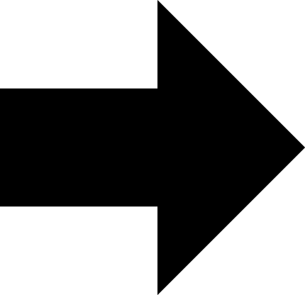
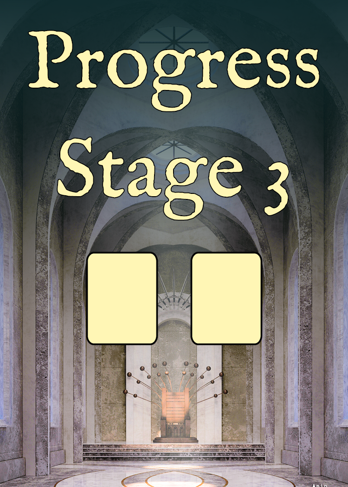
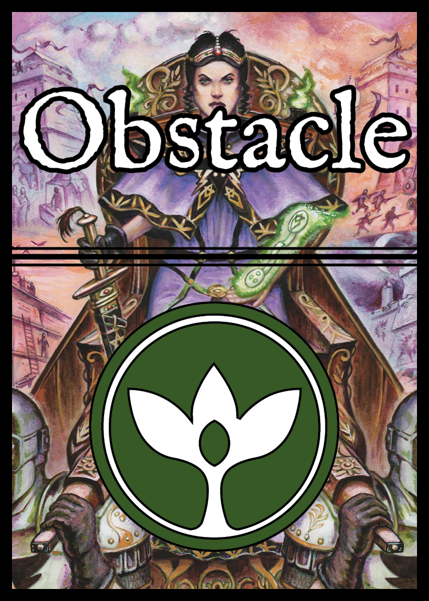

# Table of Contents

1. [**Components**](#components)
2. [**Campaign Setup**](#campaign-setup)
3. [**Session Setup**](#session-setup)
4. [**Turns**](#turns)
5. [**Actions**](#actions)
6. [**Sample Turn**](#sample-turn)
7. [**Session End**](#session-end)
8. [**Resource Mastery Bonuses**](#resource-mastery-bonuses)
9. [**Character Appendix**](#character-appendix)
10. [**Obstacle Appendix**](#obstacle-appendix)
11. [**Location Appendix**](#location-appendix)
12. [**FAQ**](#faq)
13. [**Playtest Focus Areas**](#playtest-focus-areas)

# Six Winters v19.4

*Six Winters* is a cooperative fantasy campaign game for 1-4 players based on the *Wrath of the Autarch* tabletop role-playing game.

Players control **Red Bank**, a diasporic society under threat from the **Empire of the Autarch**. The Autarch is working to achieve a sorcerous apotheosis, rendering The Empire unstoppable and spelling certain doom for Red Bank. The players have six winters to stop this from happening. Each game of *Six Winters* is 2 to 3 hours long and plays out one year in the life of Red Bank.

During a session of the game, players select from a rotating cast of characters to make progress against the Empire. Each character has their own unique capabilities and limitations. Effectively managing these characters over the six winters is critical to successfully stopping the Empire!

`As this document is very much in progress, designer thoughts and notes are captured using this highlighted formatting. They help provide context and insights, but are not essential to understanding the game. For now, I'm capturing rules in markdown, which is not a very rich textual format, but is quick to edit, and ideal for the state the game is in. The number of helpful images and diagrams is going be minimal, because they are difficult and time consuming to create for a game that is in such a fluid state. In other words: it isn't going to be easy to understand the game from this rules doc, but hopefully it's at least possible. More than anything, I'm interested in capturing a specific version of the rules to help with playtesting decisions. The version number matches that used in Tabletop Simulator. Along with those caveats, all of the graphic design and layout is only for prototype purposes and will certainly change at production time.`

## Resources

The conflict with the Empire is over six **resources**.

| Support | Technology | Espionage | Military | Diplomacy | Sorcery |
| :---: | :---: | :---: | :---: | :---: | :---: |
|  |  |  |  |  |  |
 
`These resources are fairly abstract, compared to something like ore or timber. Not totally sure if resources is the right word here, but it's the best I've come up with so far.`

## Progress

Red Bank's **progress** in each resource is marked using a red cube on an associated twelve space [**resource track**](#progress-and-threat-tracks) on the [**trade board**](#trade-board).

## Threats

**Threats** against Red Bank in each resource are tracked using a gray cube on each resource track. There are ways to slow the escalation of threats and even lower threat tracks during play.

`Lowering threat levels after they have advanced is much more difficult than trying to slow the rate of advancement in the first place. Completely stopping threats requires some luck.`

## Victory

If a Red Bank progress marker is _alone_ on the last space of the resource track (the 12th space), that resource track is **complete**. After the sixth game, check for victory as follows:

* **Pyrrhic Victory**: Red Bank has completed one of Diplomacy, Support, or Espionage.
* **Major Victory**: Red Bank has completed any two of Diplomacy, Support, or Espionage.
* **Total Victory**: Red Bank has completed all of Diplomacy, Support, and Espionage.

Any other state of the game after six sessions results in defeat for Red Bank.

Additionally, a score is calculated at the end, with players getting points for every resource track where the progress marker is higher than the threat marker.

`There are thematic reasons that Military, Technology, and Sorcery tracks don't translate to victory. It is impossible to keep pace with the Empire on the Military and Technology fronts. Sorcery is too chaotic to form a strategy around, but it's a very useful resource for some characters, and it's possible to craft and transmute sorcery into other resources. All of the resources have value and mechanical impact during the game.`

# Components

## Resource Dice

Red Bank's raw capability in a resource is represented by a [**pool**](#resource-pools) of resource dice. This pool of resource dice fluctates in size and value over the course of a game, as capabilities are used for different effects. At the end of each turn, players [**refresh**](#refresh) these pools with a number of dice equal to the value shown on the progress marker. This is normally 1 to 6 dice, depending on the resource.

Resource dice are colored as follows:

* **Support**: Yellow
* **Technology**: Orange
* **Espionage**: Red
* **Military**: Gray
* **Diplomacy**: Lavender
* **Sorcery**: Blue

## Assets

Resource pools are not as useful as **assets**: specific creations of each resource type. These are flexible concepts in the narrative. For instance, an espionage asset could represent anything from a helpful spy or contact to thieves tools or gear.

Assets are created by moving dice from resource pools onto [**location cards**](#location-cards) with the [**create asset**](#create-asset) action. Other game effects may create assets directly. Characters at the location with assets may use them to complete mission [**progress cards**](#progress-cards), as well as help [**overcome obstacles**](#overcome) or fuel character [**abilities**](#abilities).

## Action Dice

Each player has a pool of red action dice available each turn. These dice are spent to perform actions in the game. For some actions like movement, the value on the action dice doesn't matter, but for most actions the values are important.

`Think of these like the action points. Although the action points have values which can impact the abilitiy to take certain actions.`

## Character Tokens

There are tokens, or miniatures in *Tabletop Simulator*, for each character in the campaign. These are moved around the nine different **location cards** during play.

## Location Cards

Characters move around nine different locations, represented by a grid of cards. There are three locations in each of the following regions:

| The Empire | Red Bank | The Settled Lands |
| :---: | :---: | :---: |
|  |  |  |

### Location Name

Each location card has a unique name listed at the top.

### Location Tags

Location cards have a variety of tags, mostly used by other card effects. All locations have one of the following tags: urban, rural, or wilderness. Additional tags include: eldritch, vault, tavern, port, and hall.

Along with the tags are one or more icons, as follows:

| Empire | Red Bank | Settled Lands | Starting | Sorcery Threat | Military Threat | Technology Threat | Discord |
| :---: | :---: | :---: | :---: | :---: | :---: | :---: | :---: |
|  |  |  |  |  |  |  |  |

* **Empire** - Imperial location, in the Empire locations deck and playable to the Empire region
* **Red Bank** - Red Bank location, in the Red Bank locations deck and playable to the Red Bank region
* **Settled Lands** - Settled Lands location, in the Settled Lands location deck and playable to the Settled Lands region
* **Starting Location** - In the default campaign mode, this is one of the nine starting location cards
* **Sorcery Threat** - Comes into play if the sorcery threat track reaches the final space
* **Military Threat** - Comes into play if the military threat track reaches the final space
* **Technology Threat** - Comes into play if the technology threat track reaches the final space
* **Discord** - Comes into play if one of the characters, Oniri, sustains too much stress (see below)

### Create Asset Skill

The upper right of each location card shows the character [**skill**](#skills) used for the [**create asset**](#create-asset) action. Creating assets moves resource dice from resource pools onto location cards.

### Movement Costs

Along the bottom of each card are [**movement**](#move) costs for each region. A player spends the listed number of action dice to move their character to any location in that region. The value of the action dice don't matter for movement.

### Location Effect Icon (Optional)

The upper left of each location card contain optional icons indicating various effects.

| Port | Magic Gate | Support Source | Technology Source | Espionage Source | Military Source | Diplomacy Source | Sorcery Source |
| :---: | :---: | :---: | :---: | :---: | :---: | :---: | :---: |
|  |  |  |  |  |  |  |  |

* **Port**: A character may spend one action die to move from this location to another port location
* **Magic Gate**: A character may take on psyche stress (see below) to move from this location to another gate location
* **Support Source**: Roll and place a support die at this location when location is activated
* **Technology Source**: Roll and place a technology die at this location when location is activated
* **Espionage Source**: Roll and place an espionage die at this location when location is activated
* **Military Source**: Roll and place a military die at this location when location is activated
* **Diplomacy Source**: Roll and place a diplomacy die at this location when location is activated
* **Sorcery Source**: Roll and place a sorcery die at this location when location is activated

### Location Text (Optional)

Locations may have a variety of effect text as well. This text applies to any character at the location, or in some cases moving to the location. Most location text includes one of the following icons:

| Starting Obstacle | Action | Activation |
| :---: | :---: | :---: |
|  |  |  |

* **Starting Obstacle**: When this location is put into play, attach the listed obstacle(s) to it
* **Action**: By spending an action die (value doesn't matter), players may take the listed [**location action**](#location-action)
* **Activation**: This text takes effect if this location is activated during the [**activation**](#activation) phase

## Progress Cards

Progress cards are the main path to victory. Completing progress cards allows players to improve the progress tracks for Red Bank. Progress cards are completed by placing asset dice on them, creating an unbroken path from the starting position (the square with the diamonds on top) to the ending position (the square with diamonds on the bottom). From the starting position, dice are placed either orthogonally or diagonally in a chain towards the ending position. Typically there are many such paths from beginning to end which may be taken.

Asset dice may be moved from the character's location onto the controlling player's progress card. This does not require an action. Most progress card squares have restrictions on dice that may be placed there. These restrictions are depicted by colors and symbols on each square. Symbols include:

* **Solid Colors**: Dice of the corresponding resource color must be placed there. Solid white squares are wildcards, and dice of any resource type and value may be placed there 
* **Dice Faces**: Dice matching the value must be placed there. If the die has a color, the color *and* value of the die must match. White dice must match the value, but may be of any resource type
* **Region Symbol**: Players may place assets of any resource type and value there, provided the character is in the region depicted. If the region symbol has a color, the character must be in a location matching the region and resource type
* **+1, -1, =**: The die placed must match the given relation to the previous die in the chain. The +1 die must be one higher in value than the previous die in the chain, the -1 die must be one lower, and the = die must be equal

 

### Reward

When a progress card is completed, the resource progress track listed on the bottom middle of the progress card is increased by one. Some progress cards have more than one resource symbol, in which case corresponding progress tracks are increased by one for each symbol. Finally, some progress cards have the following wild card symbol, which allows players to increase any progress track by one:

| Progress Wildcard |
| :---: |
|  |

### On Two Fronts Example

The first square shows an icon for *Red Bank*. In order to put an asset die in this square, it must come from one of the three *Red Bank* locations. After the first die is place, the player has a choice: may go along the diagonal by placing a value five die of any resource type (white dice can be of any resource type), or place an espionage die (espionage dice are red) of any value below the starting position. The shortest path to the end is along the diagonal, but it is usually more difficult to match a particular die value.

Assuming the player places a five die, the next choice is continuing along the diagonal by placing a technology die of any value (technology dice are orange) or moving to the right by place any asset die (white squares can take a die of any resource type or value). It's a little longer to use the two wildcard spaces to get to the final space, but could be easier than finding a technology asset. Finally, the last space needs an asset dice from one of the three *Empire* locations.

Upon placing the die in the ending square, the progress card is completed. All of the resource dice are discarded and the military progress track is increased by one.

### Obstacle Location

The lower right section of each progress card shows a location position, used during the [**new obstacles**](#new-obstacles) and [**obstacle surge**](#obstacle-surge) phases.

### Stages and Difficulty

The back of each progress card show the current stage and a **difficulty** for the stage, shown by a number of stars. These stars come into play when drawing obstacles in the [**new obstacles**](#new-obstacles) phase.

Progress cards are separated and grouped by stage. All the stage one cards are shuffled together, the stage two cards are shuffled together, etc. Players progress through stages as the game goes on. Over the course of the campaign, the lower stage cards are burned (removed from the campaign) such that later games in the campaign begin with the progress deck in later stages.

## Obstacle Cards

Obstacle cards represent adversaries, challenges, but also opportunities for Red Bank. There is one deck of obstacle cards for each region: *The Empire*, *Red Bank*, and the *Settled Lands*. Over the course of the campaign, obstacle cards may move between decks, and decks may grow or shrink based on campaign events. Obstacle cards come into play at locations during the [**new obstacles**](#new-obstacles) and [**obstacle surge**](#obstacle-surge) phases, causing effects which are usually negative for the characters and *Red Bank*.

Obstacle cards are unlocked at the start of the campaign and during the [**unlock new locations**](#unlock-new-locations) and [**unlock new obstacles**](#unlock-new-obstacles) game end steps.

 

### Obstacle Name

Every obstacle card has a name, although they are not all unique. There are multiple copies of some obstacles.

### Obstacle Tags

Below the name, as for location cards, are a set of text tags and icons for each obstacle. Similarly to locations, these text tags may interact with other obstacle cards, location effects, and character abilities.

### Obstacle Unlock Icon

Along with the tags each obstacle has one icon, which shows how it becomes unlocked::

| Location | Support Threat | Technology Threat | Espionage Threat | Military Threat | Diplomacy Threat | Sorcery Threat |
| :---: | :---: | :---: | :---: | :---: | :---: | :---: |
|  |  |  |  |  |  |  |

* **Location** - This obstacle comes into play attached to the location with the obstacle's name in its text box
* **Support Threat** - This obstacle comes into play at the end of a session if the support threat track is increased at or above the obstacle difficulty
* **Technology Threat** - This obstacle comes into play at the end of a session if the technology threat track is increased at or above the obstacle difficulty
* **Espionage Threat** - This obstacle comes into play at the end of a session if the espionage threat track is increased at or above the obstacle difficulty
* **Military Threat** - This obstacle comes into play at the end of a session if the military threat track is increased at or above the obstacle difficulty
* **Diplomacy Threat** - This obstacle comes into play at the end of a session if the diplomacy threat track is increased at or above the obstacle difficulty
* **Sorcery Threat** - This obstacle comes into play at the end of a session if the sorcery threat track is increased at or above the obstacle difficulty

### Difficulty

The upper left of the obstacle shows its difficulty from 1 to 6. This comes into play when taking the **Overcome Obstalce* action.

### Region

Below the difficulty is a region symbol. This shows which region deck the obstacle starts in. It is possible for obstacles to move to a different region deck.

### Threats

Along the right side of the obstacle are one or more threat icons, showing one of the six resources in the game. If there are *three* or more obstacles in play with the same obstacle symbol during the [**threats**](#threats) phase, the related threat track will increase.

### Effect

Many obstacles have text that details game effects while the obstacle is in play. Text may be preceded by the following symbols:

| Activation | Overcome |
| :---: | :---: |
|  |  |

* **Activation**: This text takes effect if this obstacle is activated during the [**activation**](#activation) phase
* **Overcome**: This text takes effect if the obstacle is overcome using the [**overcome obstacle**](#overcome-obstacle) action

### Overcome Skill

This character skill is used during the [**overcome obstacle**](#overcome-obstacle) action.

### Attack

Each obstacle may inflict psyche stress, body stress, or both. Each symbol in the lower left of the obstacle indicates one stress of the particular type. This may occur as part of the [**overcome obstacle**](#overcome-obstacle) action.

### Defense

To remove an obstacle from play (overcome the obstacle), players need to spend specific action dice matching the listed dice in the lower right of the obstacle during the [**overcome obstacle**](#overcome-obstacle) action.

### Season Sybmol

The back of each obstacle card shows one of four season symbols, as follows:

| Spring | Summer | Fall | Winter |
| :---: | :---: | :---: | :---: |
|  |  |  |  |

Since there are three obstacle decks, one for each region, there are 0 to 3 symbols of a particular type showing at any time. This affects which locations get activated during the [**activation**](#activation) phase, which seasonal event card comes into play during the [**seasonal event**](#seasonal-event) phase, as well as how many turns players get each season.

## Seasonal Event Cards

At the beginning of each turn a seasonal event card comes into play, based on the number of season symbols showing on the obstacle decks. There is one seasonal event card for each possible number of symbols between 0 and 4. Typically the seasonal events with lower numbers have more desirable effects for players.

### Season Symbol

The upper right of each seasonal event shows which season it belongs to. There are four seasonal events for each season.

### Matching Number of Symbols

The number in the upper left matches the number of season symbols of that type in play. For instance, if it is the fall season, and there is one fall symbol showing among the three obstacle decks, the *Harvest Festivals* seasonal event comes into play at the beginning of the turn.

## Trade Board

The trade board tracks time, progress tracks, threat tracks, holds resource dice, and contains spots for progress cards and seasonal events.

### Resource Pools

There are six resource pools on the trade board. At the end of each turn, players refill these pools to a number of dice equal to the value shown on the progress marker (1-6 dice). When refilling resource pools, dice already in the pool are *not* rerolled.

### Progress and Threat Tracking

Both progress and threats are tracked on the resource tracks. Red cubes are used to track Red Bank's progress and gray cubes are used to track the current threat level for that resource.

### Resource Action Slots

On each resource pool are numbered **resource action slots** from 0 to 6. These are used by characters to retrieve resource dice from each pool using the [**create asset**](#create-asset) action as well as to trade resources using the [**trade**](#trade) action.

### Resource Mastery Bonus

When Red Bank's progress track for a resource is at or beyond the **+** symbol on the resource track, Red Bank has mastery in that resource, and players gain the mechanical benefit described in the resource box. These bonuses are further clarified in the [**resource bonuses**](#resource-bonuses) section.

### Wheel of Seasons

Each session starts in the winter. There are one or two turns per season. Game turns are tracked on the wheel of seasons, starting with the second winter space marked in green.

### Wheel of Years

Years may be tracked on the trade board, starting at year one and ending at year six. Each game advances time by one year.

### Progress

In order to win, players must complete [**progress cards**](#progress-cards). Each progress card allows the players to make progress on one or more resource tracks. During play, there are four progress cards displayed face up on the trade board. When players complete one progress card, they select the next one from the four available cards. This is described in more detail below.

## Location Board

Obstacles, locations, and characters are put into play on the location board.

### Regions

The location board is broken up into three regions, from left to right: *The Empire*, *Red Bank*, and *The Settled Lands*.

### Location Resources

Each region has a space to place three locations. Each location space has an associated **location resource**. When placing locations on the location board, cover the region symbol and leave the resource symbol showing. The location resource is used during the [**create asset**](#create-asset) action.

`There is one location resource slot for each resource with a victory condition, and two for the other three resources.`

### Obstacle Draw and Discard Decks

At the top of each region are spots to place the obstacle draw deck and obstacle discard piles.

### In Play Obstacles

To the right of each location is space to place any obstacles in play at that location. Locations may have any number of obstacles in play.

`Although any number of obstacles may be in play, the more obstacles there are, the more chance for threats, so typically players are incentivized to not let obstacles get out of hand.`

### Activation Icons

In the space where obstacles are played are season icons used during the [**activation**](#activation) phase. Obstacles and locations with activation icons on them are activated if the symbols here match the top obstacle draw card in the region.

## Character Sheet

There are separate character sheets for the seven characters in the game. At the start of the campaign, *Fuscus*, *Thea*, *Menas*, and *Keel* are unlocked. The other characters may be unlocked by overcoming specific obstacles.

### Skills

The upper left of the character sheet describes how proficient the character is at a set of six skills:

| Command | Disguise | Lore | Rapport | Combat | Tactics | Thievery | Survival |
| :---: | :---: | :---: | :---: | :---: | :---: | :---: | :---: |
|  |  |  |  |  |  |  |  |

Skills are ranked from 0 (no bubbles filled in) to 6. Skills are used in many actions: [**overcoming obstacles**](#overcome-obstacle), [**creating assets**](#create-asset), and [**trade**](#trade). They are raised by overcoming obstacles that have a difficulty higher than the character's skill.

### Stress

There are two stress tracks: one for psyche and one for body. Psyche is tracked with a blue die, and body is tracked with a red die. At the start of a game, each die is set at the top of each track, to the face shown on the stress track. These dice function as counters. As a character takes stress, the die is lowered in value.

If a character takes stress such that the tracking die would go to zero, it is set back to the maximum for that track, but moved down to the **first unmarked** box on the stress track.

`For instance, Lucia starts the game with her psyche stress tracking die set to 3. She takes 1 psyche stress trying to overcome an obstacle. Now it is set to 2. After that, she takes 4 psyche stress when a particularly bad obstacle activates. The player moves the stress die one position down (to the *Distracted* space) and resets it to 3. Typically you can't move more than one position down on the track!`

### Conditions

The stress track boxes below the starting position are called **conditions**. When the stress die moves on to one of these, cross it off. The first stress box below the starting position unlocks a [**commitment**](#commitment) ability when it is checked off. The remaining two unlock [**discord**](#discord) effects.

Conditions are recovered at the end of each game, during the [**recover conditions**](#recover-conditions) step.

If a condition box is already checked off when the stress die is moved down, **it is skipped**! Move the die down to the next open box. Characters only recover one condition on each track at the end of the game, so conditions could accumulate. Unlocking more characters and swapping them out between games is one way to minimize this.

### Knocked Out

If either stress track moves off the bottom (the die goes to zero while at *Shaken* or *Wounded*), the character is **knocked out**. They are no longer in the game for the remainder of the session. Take their token off the board.

`This is pretty rare, and to some extent players have control over this happening. Still, not sure if knocking out a character completely is the right approach here.`

### Abilities

Abilities are available to use at any time during the [**actions**](#actions) phase. Typically abilities are fueled by using dice. Players are free to use action dice, asset dice at the character's location, or resource dice from the location's associated resource pool. Some abilities are used by taking a point of psyche or body stress.

Like progress cards, abilities with a specific die value require using a die of that value. Abilities with a white box may be used with any die.

Most abilities generate or modify dice. The generated die has the same type as the die used to activate the ability. For instance, Lucia has the ability to turn a 1 die into a 2 die. If a 1 action die is used for this ability, a 2 action die is generated. If a 1 die from the location's resource pool where Lucia is at is used, then a 2 is put back into that resource pool.

Leave any dice on character abilities until the [**refresh**](#refresh) phase. Essentially, character abilities that take dice may only be used once per turn. Abilities that take stress may be used many times.

### Sample Abilities

  

Take one body stress to reroll any dice in one target pool. This can be any action dice, any asset dice where the character is located, or any dice in the location's resource pool where the character is located. Players do not have to reroll all the dice, they can choose which dice to reroll.

  

Turn a value 1 die into a value 2 die. Most characters have a "turn die X into die Y" ability. As usual, the die can come from the player's action dice, from an asset die where the character is located, or from the location's resource pool where the character is located. The new die is of the same type as the die placed on the ability.

 

These abilities are activated by placing an action die, an asset from where the character is at, or a resource die from the location's resource pool where the character is located. There are a wide variety of possible character effects.

See the [**character appendix**](#character-appendix) for a more detailed breakdown of character abilities.

### Commitment Abilities

When a character marks off the first condition box, they gain a commitment ability. Some stress is a good thing! Commitment abilities work just like other character abilities. These are unlocked in order, from top to bottom.

`Since there are only two conditions with commitment, it's usually not possible for a character to gain more than two commitment abilities in one session.`

### Discord Effects

Too much stress, though, is terrible. When either of the bottom two condition boxes are marked on the stress boxes, characters take a discord effect. The discord effects are also unlocked from top to bottom. Most discord effects require the player to write in something, such as a character name, a resource, or some other detail. These choices will make some characters unwilling to work as closely with certain characters. Choose carefully!

See the [**character appendix**](#character-appendix) for a more detailed breakdown of discord effects.

# Campaign Setup

When starting a new campaign, undertake the following steps. The campaign may be played more than once, although it is not possible to play multiple campaigns at the same time.

1. Set Initial Progress
2. Set Initial Threat Levels
3. Choose Starting Locations
4. Assemble Starting Obstacle Decks
5. Assemble New Character Sheets

## Set Initial Progress

The red cubes are used to track *Red Bank's* progress on each resource track. At the start of the campaign, the red cubes are placed on the first space of each track (the space in the upper left surrouding each resource pool). All resource pools start at size 1 except support, which is at size 2.

## Set Initial Threat Levels

The first step is to determine the difficulty of the campaign. Initial threat levels are based on difficulty. Place gray cubes at the appropriate position of each resource track:

* **Cakewalk**: First space, on same space as red threat progress cubes
* **Standard**: Third space
* **Difficult**: Sixth space
* **Tragedy Incarnate**: Ninth space, only three away from the last space of the track, when particularly bad effects kick in

At the standard and cakewalk difficulties, there's a very high chance of at least a pyrrhic victory. The game at those levels is more about what happens to characters along the way and the degree of success. At the difficult and tragedy levels, there's a chance the players will not succeed at all.

## Choose Starting Locations

The first time playing the campaign, it is suggested players use the standard starting locations. These are basic locations with no special effects text or symbols. They also cover a wide range of character skills, thus allowing any of the starting characters to have success. Use the following table to set up standard starting locations, placing one location in each slot on the location board:

| Region | Resource | Location Name |
| :---: | :---: | :---: |
|  |  | Eastkeep |
|  |  | Guild of Strategy |
|  |  | Whitehold |
|  |  | Dusk's Ayrie |
|  |  | Ferry's Glenn |
|  |  | Gray Forest |
|  |  | Lily Manor |
|  |  | Boar's Peak |
|  |  | Gravewood |

### Random Starting Locations

Alternatively, shuffle the location cards by region. Then draw four cards from each region, and choose three to put into play as desired. If any locations have attached obstacles, find and put those into play now.

`This is suggested for experienced players who don't mind having lots of location effects in play, and potentially more restrictive combinations of skills for creating assets.`

## Assemble Starting Obstacle Decks

Unlock all of the obstacles with difficulties less than or equal to the initial threat levels for that resource. The [**unlock icon**](#obstacle-unlock-icon) of the obstacle is determined by finding the small black and white icon under the title.

For instance, in the standard difficulty, the initial diplomacy threat level starts at 2. This is because the third space on the diplomacy track has a 2 on it. So gather up all of the obstacles with small black and white diplomacy unlock icons under their title of difficulty 1 and 2.

After gathering up all of the initial obstacles based on starting threat tracks, divide them into decks by region icon in the upper left, and shuffle each of these decks to form one draw pile in each region. Set aside the remaining locked obstacles.

## Assemble New Character Sheets

Get new character sheets for the seven characters in the game. At the start of a new campaign Oniri, Yasmnia, and Lucia are locked.

# Session Setup

Perform the following steps at the start of each session.

1. Fill Starting Resource and Action Dice Pools
2. Choose Characters
3. Place Obstacle Decks and Locations
4. Build Progress Deck
5. Select Starting Progress Cards
6. Place Characters at Locations
7. Place Season Time Marker

## Fill Starting Resource and Action Dice Pools

Roll and place a number of resource dice for each pool equal to the current pool size under progress marker.

Additionally, each player rolls red dice for their starting action dice pool. For the 2-4 player game, each player rolls 5 action dice. For the solo game, roll 7 action dice.

## Choose Characters

Each player should choose one unlocked character. If playing solo, choose two characters.

## Place Obstacle Decks and Locations

Place each obstacle deck in the appropriate region. Aside from the first session of a new campaign, obstacle decks are not shuffled at game start. Retrieve locations and attached obstacles from the previous game and put them into play.

## Build Progress Deck

Gather all progress cards in play, and group them by stage. Shuffle each stage separately, then place them into one draw pile, organized by stage with lowest stage at the top and the highest stage at the bottom.

## Select Starting Progress Cards

Each player draws two progress cards and chooses one to start with. The cards not selected are placed in the progress staging area in any order desired.

### New Campaign Starting Obstacles

If this is the first game of a new campaign, draw and place one obstacle at the obstacle location for each progress card. This is the location indicated in the lower right of the progress card.

## Place Characters at Locations

Finally, each player may place a token for their character at any desired location.

## Place Season Time Marker

Turns are tracked using the season time marker. The game starts in winter. Place the season time marker on the solid winter box.

# Turns

A turn in *Six Winters* is composed of the following phases.

1. Seasonal Event
2. Actions
3. Refill
4. Activation
5. New Obstacles
6. Threat Tracks
7. Obstacle Surge
8. Advance Time

## Seasonal Event

Gather the four seasonal event cards for the current season. Put the seasonal event card into play which matches the number of currently showing season symbols (between 0 and 3) on the back of the three obstacle decks. Follow instructions on seasonal event card.

`Typically the higher number seasonal event cards are more difficult for players.`

## Actions

The action phase is the main part of each turn. During the actions phase, players spend their action dice to perform actions. Actions may be taken in any order by any player. When all players are done spending action dice and using character abilities, the actions phase is complete. See **Actions** below for a detailed explanation of all possible actions.

Up to **three** action dice may be kept for next turn. The rest are discarded. It's generally wise to use as many action dice as possible.

Character abilities are normally used during this phase as well.

### Solo Actions

When playing solo, action dice may be used for *either* character's actions, as desired.

## Refresh

Resource dice are rolled and added to each resource pool until there are a number of dice matching the progress number for that pool. Do not reroll any resource dice already in the pool, and do not remove any dice if there are more dice in the pool than the progress number indicates.

Next, each player gets **five** new action dice, rolling them and adding them to any action dice kept from the previous phase (up to three may be kept).

Finally, remove any dice on character or commitment abilities.

### Solo Refresh

If playing solo, take **seven** action dice instead. May only save up to three action dice from the previous phase, as normal.

## Activation

Starting with the Empire region, and ending with the Settled Lands, activate locations and obstacles based on the season symbol showing for that region. The spring symbol activates the top location card and any attached obstacles are activated, the summer symbol activates the middle location and obstacles, the fall symbol activates the bottom location and obstacles, and the winter symbol activates *all* locations and obstacles in the region.

Follow any activation effect text on activated locations and obstacles. Make sure to check for resource effect icons on location cards, which create an asset at the location.

## New Obstacles

Draw and place new obstacles equal to the current stage difficulty (the number of stars on the back of the top card in the progress deck).

To place an obstacle:

* Look at the lowest card in the progress staging area
* Place an obstacle at the obstacle location on this progress card (in the lower right of progress card)
* Discard the progress card

There will now be a number of open positions in the progress staging area equal to the current stage difficulty. After placing obstacles, slide down any remaining progress cards so they fill the lowest staging area positions, and refill any open progress staging card positions at the top by drawing from the progress deck.

## Threat Tracks

Raise each threat track by one for every matching threat symbol on obstacle cards beyond two. For instance, if there are 4 military thret icons on the obstacle cards, the military threat track will increase by 2. If there are 3 diplomacy threat icons on obstacles, the diplomacy threat track will increase by 1, etc.

If a threat track is already at the highest position (step 12 on the track), increase the next threat track in trade order. For instance, if the support track is maxed out, increase technology instead. If sorcery is maxed out, players may choose which track to increase.

`Unless playing at a very hard difficulty, maxing out a threat track is fairly rare, and typically only happens near the end of the campaign.`

## Obstacle Surge

In a three player game, place one more obstacle in play, following the **new obstacles** steps above. In a four player game, place two new obstacles following the **new obstacles** steps.

`Three and four player games have more obstacles, but they come out after determining threats.`

## Advance Time

The final step of the turn is to advance the seasonal time marker. Only advance to the second turn of a season, as indicated by a dotted box around the season symbol, if one or more matching symbols are on the obstacle cards. If the time marker advances back to the first winter symbol, the game is over. If this was the sixth game, the campaign is over.

`There are between 4 and 8 turns in a game.`

# Actions

Spending action dice to take actions makes up the core of *Six Winters*. Most character abilities are used during this phase, by manipulating action dice, assets, or resource pool dice. Players may only take actions at the location where their character is currently at.

* Move
* Create Asset
* Trade
* Overcome
* Location Action

`If playing solo, may take actions at either character location.`

## Move

Every location card lists action dice costs for traveling to each region in the game. To move to a different location, spend a number of action dice equal to the amount indicated for the destination location's region. The value of the action dice don't matter.

Some locations have restrictions on what regions can be moved to directly. For instance, characters can only move from *Whitehold* to other Imperial locations.

## Create Asset

This action moves resource pool dice matching the location's resource slot to the location where the character is at. Asset dice are free to use by any character at the location, usually for filling in progress cards, so this is a very common action. The steps to create an asset are:

1. Place an action die on an open create asset slot for the pool matching the location's resource
    * The action die must be placed in an open slot less than or equal to the character's skill for creating assets at this location
2. Move a resource die from pool that is **less than or equal to** the value of the placed action die

Note that the support progress bonus allows players to move **all** resource dice matching the value of the action die. This allows players to potentially create multiple assets with one action die.

## Trade

Trade works similarly to creating assets, although it allows players to move resource dice between pools. The steps to trade are:

1. Place an action die on an open action slot for the pool matching the location's resource
    * The action die must be placed in an open slot less than or equal to the character's skill for resource actions at this location
2. Move a resource die into or out of this pool that is **less than or equal to** the value of the placed die
    * The dice are moved along the wheel of trade (support -> technology, technology -> espionage, etc.)
    * When a die is moved from one resource pool to another, it changes type
    * Dice from the sorcery pool may move into any other resource pool, but no resource may by converted to sorcery dice

## Overcome Obstacle

Overcome allows players to discard obstacles from the location board where their character is located. To overcome an obstacle, dice must be placed on the obstacle matching the dice values in the defense pattern. This is done by:

1. Approach
2. Defend
3. Overcome

Before starting the overcome process, determine if any of the characters attempting to overcome the obstacle are **skilled**. A character is skilled against an obstacle if the character's skill is *greater than or equal to* the matching overcome skill for the obstacle. It's much easier to overcome obstacles when skilled.

### Approach

This step is only available to skilled characters. A skilled character may place any number of action dice on the obstacle.

If, after this step, the obstacle has dice on it matching the defense pattern, it is immediately overcome! Skip the defend step and move on to overcome. If only some dice match the pattern, continue on to the defend step, leaving the dice on the obstacle.

`Being skilled has huge benefits in terms of planning out turns.`

### Defend

All remaining action dice for the character are rerolled. If the character is skilled, the character successfully defends if any of these rerolled action dice are 3 or less. Otherwise, the character successfully defends if any rerolled action dice are 1.

If the character doesn't successfully defend, they take the amount of stress listed for the obstacle's attack.

### Overcome

Any of the action dice used to defend may be placed on the obstacle to help overcome it, provided of course they match the value of the defense dice on the obstacle card. If, after this step, the obstacle has dice on it matching all of its defense dice, it is overcome. When an obstacle is overcome, it is discarded to the current region's discard deck. Some obstacles have other effects when they are overcome, as indicated with an overcome icon in the effect text section.

Finally, if the character is unskilled, **they may increase their skill by one**. Characters improve their skills by overcoming difficult obstacles.

If the obstacle doesn't have dice on it matching the pattern, leave any dice on it. Further dice may be added with more overcome actions on the same or future turns.

### Teamwork

Multiple characters may work together to overcome an obstacle, provided of course they are at the same location with the obstacle. In this case, any skilled characters may add dice and check for success during the approach. All characters will defend if *any* character successfully defends, and all players may check to overcome the obstacle. 

Any characters may increase their skills, as long as the character's skill is less than the obstacle's difficulty as normal.

### Assets and Obstacles

Assets at the location with the obstacle may be placed on the obstacle during the overcome step.

## Location Action

Some locations allow characters there to spend an action die to perform the listed effect. The value of this action die doesn't matter.

# Sample Turn

TBD

# Session End

At the end of each session, complete the following steps:

1. Burn Obstacles
2. Unlock New Obstacles
3. Shuffle Obstacle Decks
4. Burn Locations
5. Unlock New Locations
6. Recover Unlocked Characters
7. Advance Year

## Burn Obstacles

In each region's obstacle discard pile, burn the obstacle card on the bottom the discard deck. That is, the first obstacle discarded.

## Unlock New Threat Obstacles

For each threat track, unlock obstacle cards with the given threat unlock icon of a difficulty less than or equal to the threat level. Place the unlocked obstacled cards in the region discard pile matching the region symbol of each obstacle.

## Shuffle Obstacle Decks

For each region, shuffle the obstacle discards with the draw decks and form new draw decks.

## Burn Locations

In each region, burn the location card with the most attached obstacles. If there is a tie, choose the location card.

Place any attached obstacles from the burned location **on top** of the associated region draw deck in any order desired.

## Unlock New Locations

For each region, shuffle the region's location deck and draw two locations. Choose one card from each region deck to put into play, placing the location in the appropriate region. Players may look at all six cards before making decisions on what locations to use for next session.

Some location cards will unlock new location obstacles at this time. If the location has a starting obstacle icon, look through the locked obstacle cards and put any matching named obstacles into play with the location. 

## Recover Conditions

Each unlocked character recovers the first (the one closest to the starting stress position) marked condition box on each track. Erase the mark on this condition. More severe conditions, like *Wounded*, could be difficult to clear if character's are frequently marking multiple conditions!

Note that **all** unlocked characters recover one condition on each stress track, even if they weren't active for this session. This is a way to let badly stressed characters have some extra recovery.

## Advance Year

The year advances by one. If this is year six, the campaign is over, move on to [**campaign end**](#campaign-end).

## Store Game

For *Tabletop Simulator*, this is probably straightforward. In the real game, decks will have to be stacked in such a way that they are easy to recover again.

# Campaign End

As described in [**victory**](#victory), check for victory as follows:

* **Pyrrhic Victory**: Red Bank has completed one of Diplomacy, Support, or Espionage.
* **Major Victory**: Red Bank has completed any two of Diplomacy, Support, or Espionage.
* **Total Victory**: Red Bank has completed all of Diplomacy, Support, and Espionage.

Players get 1 point for a pyrrhic victory, 3 points for a major victory, and 6 points for a total victory. Additionally, players get 1 points for every non-victory (Technology, Military, and Sorcery) resource track in which Red Bank's progress is higher than the threat marker.

Finally, multiply the total points by the difficulty to find your score:

* **Cakewalk**: x1
* **Standard**: x2
* **Difficult**: x3
* **Tragedy Incarnate**: x4

| Score | Result |
| :-- | :-- |
| 1 | Achievement: Acolyte of Six Winters |
| 2-5 | Achievement: Novice of Six Winters |
| 6-10 | Achievement: Adept of Six Winters |
| 11-15 | Achievement: Initiate of Six Winters |
| 16-20 | Achievement: Disciple of Six Winters |
| 21-25 | Achievement: Master of Six Winters |
| 26-30 | Achievement: Superior Master of Six Winters |
| 30-35 | Achievement: Grand Master of Six Winters |
| 36 | Achievement: Autarch of Six Winters |

`My plan is to eventually have some fiction and character epilogues around these different win conditions. That could be a fun thing to do per session as well, but there's already a lot going on.`

# Resource Mastery Bonuses

## Support

May create assets from or trade using *all* the resource dice matching the value of the action die used. This makes sets of the same value in resource pools particularly easy to move around.

## Technology

All players get one additional action die at the start of each turn.

## Espionage

Whenever an espionage asset of value 2 is created, roll an additional espionage asset. Continue creating additional espionage assets until a number other than 2 is rolled.

## Military

May move any assets *from* a military location to any other location.

## Diplomacy

May trade 2 resource dice for any 1 resource die along the wheel of [**trade**](#trade). That is, 2 technology resource dice may be spent to roll a new espionage resource die, 2 espionage resource dice for a military resource die, 2 sorcery resource dice for any other resource die, etc. This may be done by any player freely at any time.

## Sorcery

Sorcery assets may be treated as any resource type or die value when playing onto progress cards. Note that the sorcery asset die value may not be changed, but rather the resource type and value restrictions are ignored.

# Character Appendix

## Fuscus

### Subtract One

Spend a die and gain a die of one value lower.

## Keel

### Die Split Effect

    

Spend a die and gain two dice of the same type. The two dice must sum to the spent die.

## Menas

### Exploding Threes

  

Spend a die to explode all value 3 dice in a chosen pool. The pools that may be selected are: your action dice, assets where Menas is located, or the location's resource dice pool where Menas is located. Take an extra die of the appropriate type for each 3 in the pool and roll them. If any of those dice roll a 3, take additional dice and roll those. Continue gaining new dice every time a 3 is rolled.

## Thea

### Rearrange Staged Achievements

Spend a die to rearrange the four staged achievements in any order desired. As normal for character abilities, this may be done at any time during the actions phase. Commonly this is done when a player completes a progress card and is about to draw a new one or at the end of the actions phase to set up for future obstacle draws.

### Change Asset Type

 

Take an asset die at Thea's location, place it on the asset icon and change the resource type to something else. Keep the value the same.

# Obstacle Appendix

TBD - Will add clarifications for obstacle cards as needed.

# Location Appendix

TBD - Will add clarifications for location cards as needed.

# FAQ

TBD - Will add rules clarifications as needed.

# Playtest Focus Areas

Since this is a game in active development, there are some areas in particular that could use more work.

## Obstacle Campaign Arc

The biggest area to watch surrounds how new obstacles are unlocked and put into the game and how (or if) obstacles are burned and taken out of the game. Having obstacles be tied to threat tracks is probably a good way to do it. Currently the starting obstacle decks have a wide variety of cards.

### Burning Obstacles

Obstacles leaving play is also up for debate. Some options:

1. No obstacles are burned
2. Certain obstacles specify if they are burned when they're overcome
3. Character abilities burn obstacles
4. Some number are burned at the end of every game

Initially I thought the obstacle decks would cycle quite a bit, so there was almost a deck builder aspect to the game. That hasn't really happened for a variety of reasons (mainly because of how obstacles are tied to threats). But! It still seems fun, if, like locations, they obstacle decks start one way, and slowly change over time.

I'm currently leaning towards 3 or 4.

## Character Abilities

There's lots of room to tune character abilities, particularly around writing customizing characters over the campaign.

Dice combos and chains are probably the funnest part of the game. Not surprising given it's a dice game. So character effects that are like "spend a pair" to get XYZ or "a straight of size X" gives you some powerful effect, etc, would be fun advanced abilities.

## Obstacle and Location Effects

As with characters, there are tons of options for obstacle and location effects. That kind of tuning can go on forever, but it's good to find the cards that really aren't working, and brainstorm new options.

## Feedback

If you're comfortable using github, you can also submit issues there for ideas and feedback: https://github.com/ziapeltagames/six-winters/issues