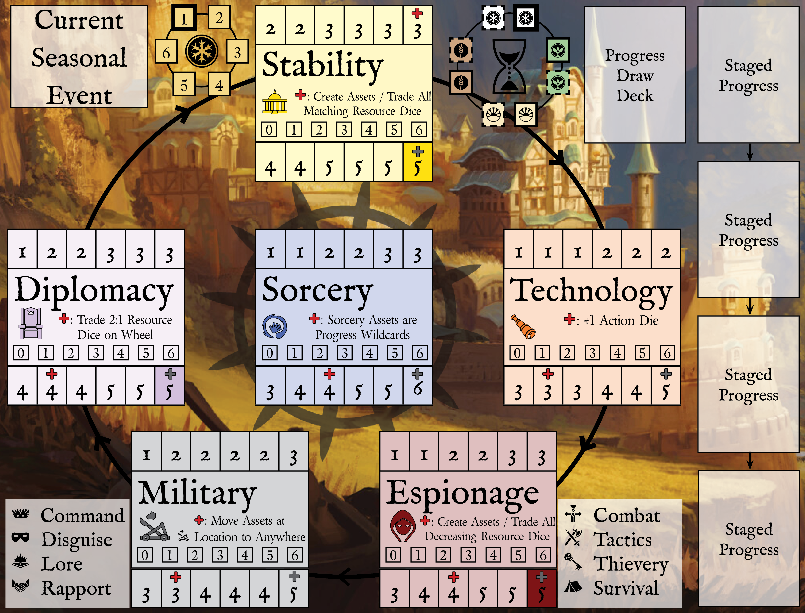

# Six Winters v19.3

*Six Winters* is a cooperative fantasy campaign game for 1-4 players based on the *Wrath of the Autarch* tabletop role-playing game.

Players control **Red Bank**, a diasporic society under threat from the **Empire of the Autarch**. The Autarch is working to achieve a sorcerous apotheosis, rendering The Empire unstoppable and spelling certain doom for Red Bank. The players have six winters to stop this from happening. Each game of Six Winters is 2 to 3 hours long and plays out one year in the life of Red Bank.

During a session of the game, players select from a rotating cast of characters to make progress against the Empire. Each character has their own unique capabilities and limitations. Effectively managing these characters over the six winters is critical to successfully stopping the Empire!

`As this document is very much in progress, designer thoughts and notes are captured using this highlighted formatting. They help provide context and insights, but are not essential to understanding the game. For now, I'm capturing rules in markdown, which is not a very rich textual format, but is quick to edit, and ideal for the state the game is in. The number of helpful images and diagrams is going be minimal, because they are difficult and time consuming to create for a game that is in such a fluid state. In other words: it isn't going to be easy to understand the game from the given rules doc, but hopefully it's at least possible. More than anything, I'm interested in capturing a specific version of the rules to help weight playtesting decisions. The version number matches that used in Tabletop Simulator. Along with that, all of the graphic design and layout is only for prototype purposes and will certainly change at production time.`

## Resources

Characters leverage six **resources** to make progress against the Empire:

| Support | Technology | Espionage | Military | Diplomacy | Sorcery |
| :---: | :---: | :---: | :---: | :---: | :---: |
|  |  |  |  |  |  |
 
Red Bank's **progress** in those areas is marked using a red cube on each associated twelve space **resource track**.

## Threats

**Threat levels** against Red Bank in each resource area are tracked using a gray cube on each resource track. If Red Bank's progress is higher than the associated threat marker, the players have **advantage** in that resource, which confers mechanical advantages during play. There are ways to slow the rate of threats and even lower threat levels during play.

`Lowering threat levels after they have advanced is much more difficult than trying to slow the rate of advancement in the first place. Completely stopping threat advancements requires some luck.`

## Victory

If the Red Bank progress marker is _alone_ on the last space of a resource track, that resource track is **complete**. After the sixth game, check for victory as follows:

* **Pyrrhic Victory**: Red Bank has completed one of Diplomacy, Support, or Espionage.
* **Major Victory**: Red Bank has completed any two of Diplomacy, Support, or Espionage.
* **Total Victory**: Red Bank has completed all of Diplomacy, Support, and Espionage.

Additionally, the players get bonus points for every track they have advantage in and for the level of difficulty chosen at the start of the campaign.

Any other state of the game after six sessions results in defeat for Red Bank.

# Components

## Resource Dice

Each resource has an associated pool of resource dice used by characters to overcome **obstacles**, fuel character abilities, and complete mission **progress cards**. At the end of each turn, players refill these pools to a number of dice equal to the value shown on the progress marker (1-6 dice).

Resource dice are colored as follows:

* **Support**: Yellow
* **Technology**: Orange
* **Espionage**: Red
* **Military**: Gray
* **Diplomacy**: Lavender
* **Sorcery**: Blue

`The dice in resource pools represent the raw capability of Red Bank in that area.`

## Assets

Resource dice are not very useful in resource pools, so players will frequently move them on to **location cards** first. Resource dice placed on location cards are referred to as **assets**. Assets are freely available for characters at that location to use.

`If resource pools are raw capabilities, assets are able to be utilized. Their form in the narrative is flexible. An espionage asset could represent anything from a helpful spy or contact to thieves tools or gear.`

## Action Dice

Each player has a pool of red action dice available each turn. These dice are spent to perform actions in the game. For some actions, the value on the action dice doesn't matter (such as moving from one location to another), but for most actions the value is important.

`Think of these like the action points in a game like Oath. Although the action points have values which can impact the abilitiy to take certain actions.`

## Character Tokens

There are tokens (miniatures in *Tabletop Simulator*) for each character in the campaign. These are moved around the nine different **location cards** during play.

## Locations

There are nine different location cards in play, three in each of the following regions:

| The Empire | Red Bank | The Settled Lands |
| :---: | :---: | :---: |
|  |  |  |

### Name

Each location card has a unique name listed at the top.

### Tags

Location cards have a variety of tags, mostly used by other card effects. All locations have one of the following tags: urban, rural, or wilderness. Additional tags include: eldritch, vault, tavern, port, and hall.

Along with the tags are one or more icons, as follows:

| Empire | Red Bank | Settled Lands | Starting | Sorcery Threat | Military Threat | Technology Threat | Discord |
| :---: | :---: | :---: | :---: | :---: | :---: | :---: | :---: |
|  |  |  |  |  |  |  |  |

* **Empire** - Imperial location, in the Empire locations deck and playable to the Empire region
* **Red Bank** - Red Bank location, in the Red Bank locations deck and playable to the Red Bank region
* **Settled Lands** - Settled Lands location, in the Settled Lands location deck and playable to the Settled Lands region
* **Starting Location** - In the default campaign mode, this is one of the nine starting location cards
* **Sorcery Threat** - Comes into play if the sorcery threat track reaches the final space
* **Military Threat** - Comes into play if the military threat track reaches the final space
* **Technology Threat** - Comes into play if the technology threat track reaches the final space
* **Discord** - Comes into play if one of the characters, Oniri, sustains too much stress (see below)

### Invest Skill

The upper right of each location card shows the skill icon used for the **invest** action. Investing is how resource dice are moved from resource pools into a location card.

### Movement Costs

Along the bottom of each card are movement costs for each region. A player spends the listed number of action dice (the value of the dice do not matter) to move their character to any location in that region.

### Effect Icon (Optional)

The upper left of each location card may contain optional icons indicating various effects.

| Port | Gate | Support Source | Technology Source | Espionage Source | Military Source | Diplomacy Source | Sorcery Source |
| :---: | :---: | :---: | :---: | :---: | :---: | :---: | :---: |
|  |  |  |  |  |  |  |  |

* **Port**: A character may spend one action die to move from this location to another port location
* **Gate**: A character may take on psyche stress (see below) to move from this location to another gate location
* **Support Source**: Roll and place a support die at this location when activated
* **Technology Source**: Roll and place a technology die at this location when activated
* **Espionage Source**: Roll and place an espionage die at this location when activated
* **Military Source**: Roll and place a military die at this location when activated
* **Diplomacy Source**: Roll and place a diplomacy die at this location when activated
* **Sorcery Source**: Roll and place a sorcery die at this location when activated

### Location Text (Optional)

Locations may have a variety of effect text as well. This text applies to any character at the location, or in some cases moving to the location. Most location text includes one of the following icons:

| Starting Obstacle | Action |
| :---: | :---: |
|  |  |

* **Starting Obstacle**: A character may spend one action die to move from this location to another port location
* **Action**: A character may take on psyche stress (see below) to move from this location to another gate location

## Progress

TBD

## Obstacles

TBD

## Events

TBD

## Tags

Tags might appear on cards to give them more flavor and pair with character abilities. Cards don't have to have tags.

Common tags: Wilderness, Urban, Red Bank, Sorcery, Guard, Undead, Beast, Diplomat, Trap, Challenge, Environment, Condition, Asset, Resource, Secret, Favor

# Trade Board

## Resource Pools

 At the end of each turn, players refill these pools to a number of dice equal to the value shown on the progress marker (1-6 dice).

## Investment Slots

On each resource pool are numbered **investment slots** from 0 to 6. These are used by characters to retrieve resource dice from each pool.

## Wheel of Seasons

Each session starts in the winter. There are one or two turns per season. Game turns are tracked on the wheel of seasons, starting with the second winter space marked in green.

## Wheel of Years

Years may be tracked on the trade board, starting at year one and ending at year six. Each game advances time by one year.

## Progress

In order to win, players must complete **progress cards**. Each progress card allows the players to make progress on one or more resource tracks. During play, there are four progress cards displayed face up on the trade board. When players complete one progress card, they select the next one from the four available cards. This is described in more detail below.

# Location Board

TBD

# Characters

## Skills

## Abilities

## Stress

## Conditions

## Motivation

## Discord

# Campaign Setup

TBD

# Session Setup

TBD

* Choose Spotlight Player
* Spotlight Player Rolls Starting Resources
* Draw Starting Threat
* Choose Missions
* Choose Spotlight Locations
     * Type of locations may be dictated by threat card
     * Six total spotlight locations
* Divide Up Characters
     * Each player needs at least one character
* Divide Up Assets
     * Must place character cards (lifepath and discord) with appropriate group
* Place Starting Mission Cards
* Place Characters at Locations
     * At least one character in group must be in mission location

# Turns

A turn in _Six Winters_ is composed of the following phases.

## Seasonal Event

TBD

## Actions

TBD

## Refill

TBD

## Activation

TBD

## Obstacles

TBD

## Threats

TBD

## Surge

TBD

## Time

TBD

# Actions

TBD

## Movement

* Move to any location in the same mission area or to/from a spotlight location
     * Must leave at least one character in current mission area

## Invest

TBD 

## Trade

TBD

## Overcome

TBD

## Location Action

TBD

# Overcome

TBD

# Session End

TBD

# Campaign End

TBD